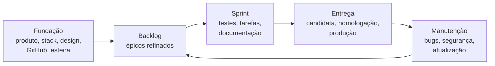

# Big Bang

> Um framework para **uma pessoa, com uma ou mais IAs**, planejar, construir e manter sistemas profissionais:
> bem arquitetados, seguros, testados e 100% documentados.

## Índice

- [Estado atual](#estado-atual)
- [O que é o Big Bang](#o-que-é-o-big-bang)
- [Para quem é (e para quem não é)](#para-quem-é-e-para-quem-não-é)
- [O que você precisa](#o-que-você-precisa)
- [Como começar](#como-começar)
- [O que vai acontecer](#o-que-vai-acontecer)
- [Depois da Fundação](#depois-da-fundação)
- [Como a esteira funciona](#como-a-esteira-funciona)
- [Exemplo real: ScreenFakeCam](#exemplo-real-screenfakecam)
- [Segurança](#segurança)
- [Versões e atualização](#versões-e-atualização)
- [Documentação do framework](#documentação-do-framework)
- [Contribuindo](#contribuindo)
- [Licença](#licença)

## Estado atual

Estável desde a **1.0.0**, validada num sistema real feito do zero até produção só pelo Big Bang: o
[ScreenFakeCam](https://github.com/BrunodosSantosVaz/screenfakecam), um app Android publicado em três versões e
testado pelo dono num celular ([relatório do piloto](.bigbang/docs/piloto-screenfakecam.md)). A versão atual está
nas [Releases](https://github.com/BrunodosSantosVaz/big-bang/releases/latest). O que ainda falta validar fora de
contêiner, como o deploy num servidor real, está nas [issues abertas](https://github.com/BrunodosSantosVaz/big-bang/issues).

## O que é o Big Bang

O Big Bang é um repositório-modelo do GitHub que vira o próprio repositório do seu sistema. Você cria um
repositório a partir dele, abre qualquer IA para código na pasta e diz **"iniciar projeto"**. A partir daí, os
arquivos do framework conduzem a IA por todo o ciclo de vida do sistema, com você decidindo nos pontos de
controle. Ele não gera o sistema de uma vez: ele **governa** a construção, etapa por etapa, e cobra as regras por
ferramenta (CI, testes travados, portões), não por promessa.

| Etapa | O que a IA faz com você | O que fica gravado |
| --- | --- | --- |
| Fundação | Perguntas básicas do produto; escolha de stack, arquitetura e hospedagem; design kit com protótipo; guia de permissões e montagem do GitHub; geração da esteira; esqueleto andante até produção | `PRODUTO.md`, `STACK.md`, `DESIGN.md`, `bigbang.toml`, ADRs, diagramas C4, 3 painéis, workflows |
| Backlog | "Vamos refinar o backlog": perguntas por épico até o refinamento ser aprovado; protótipo quando o épico pede | Épicos refinados, regras de negócio, critérios de aceite, protótipos |
| Sprint | "Vamos rodar a sprint": confere pré-requisitos, cria o teste, as tarefas e a documentação de cada épico, programa em paralelo, revisa | Issues, branches, PRs, testes, documentação |
| Entrega | Integração, candidata, homologação e publicação **por sprint ou por épico** (você escolhe a cada sprint) | Versões, Releases, changelog, README atualizado |
| Manutenção | Bugs, hotfix, auditoria de segurança, tecnologia nova só com você, atualização do próprio framework | Correções com teste de regressão, ADRs, relatórios |

## Para quem é (e para quem não é)

**É para** quem constrói sistemas sozinho com IAs e quer o resultado de uma equipe disciplinada: decisões
registradas, testes que a IA não pode enfraquecer, segurança verificada, documentação e README sempre em dia, e
um painel que mostra o que espera por você.

**Não é para** quem quer só um gerador de código, nem para equipes grandes com processo próprio: o Big Bang assume
um dono que decide e IAs que executam, com o GitHub como fonte da verdade.

## O que você precisa

- [Git](https://git-scm.com/)
- [GitHub CLI](https://cli.github.com/) (`gh`) autenticado (`gh auth login`)
- Python 3.11 ou superior, disponível também como comando `python` (no Ubuntu/Debian: `sudo apt install python-is-python3`)
- Uma IA para código, como Claude Code, Codex ou Cursor
- Uma conta no GitHub

## Como começar

1. No GitHub, clique em **Use this template** → *Create a new repository*. O repositório novo nasce limpo, sem o
   histórico do framework, e pode ser privado.
2. Clone o repositório novo: `gh repo clone <seu-usuario>/<seu-sistema>`.
3. Abra sua IA na pasta do repositório.
4. Diga: **"iniciar projeto"**.

## O que vai acontecer

A Fundação tem seis etapas. Cada uma vira uma issue e um PR, para ficar no histórico.

| Etapa | O que acontece | O que você decide |
| --- | --- | --- |
| **F0** · Ligar ao GitHub | A IA confere `git`, Python e `gh`, cria a `develop` e o `bigbang.toml` | Visibilidade (privado por padrão) e, se público, a licença |
| **F1** · Entrevista do produto | Até 10 perguntas, uma por vez, viram o `PRODUTO.md` | O que o sistema é, para quem, com quais dados |
| **F2** · Stack e arquitetura | A IA pesquisa e apresenta de 2 a 3 opções completas, com custo e riscos | A stack, a arquitetura e a hospedagem |
| **F3** · Design kit | Identidade, tokens, padrões de tela e protótipo navegável (se houver interface) | Aprovar o design e o protótipo |
| **F4** · Montar o GitHub | Passo a passo de permissões; painéis, labels, ambientes e travas | Executar cada passo de permissão (tokens e segredos são seus) |
| **F5** · Esteira e esqueleto andante | A IA gera a esteira e leva a menor versão do sistema até produção | Aprovar a publicação em produção |

## Depois da Fundação

O dia a dia é conversa. Você diz a intenção com as suas palavras; a IA reconhece o pedido, faz e termina dizendo o
próximo passo e o que depende de você.

| Você diz | O que acontece |
| --- | --- |
| "Ideia: …" | Vira um épico em *Brainstorm* |
| "Vamos refinar o backlog" | Perguntas por épico até o refinamento ser aprovado |
| "Vamos montar o protótipo" | Protótipo navegável no padrão do `DESIGN.md` |
| "Vamos rodar a sprint" | Pergunta se a entrega é por sprint ou por épico; teste de cada épico, tarefas, documentação, revisão |
| "Próxima tarefa" / "Codar #n" | A IA assume, programa e abre o PR |
| "Vamos homologar" | Link da candidata, o que testar e os critérios |
| "Vamos publicar" | Publicação em produção, com a sua aprovação no ambiente `producao` |
| "Vamos encerrar a sprint" | Resumo, faxina (branches, issues e repositórios que sobraram), README conferido, retrospectiva |
| "Bug: …" / "Corrigir #n" / "Hotfix #n" | Teste que falha primeiro, depois a correção |
| "Audita a segurança" | Relatório e issues `[Segurança]` |
| "Como está o projeto?" | Resumo dos painéis e do que espera por você |
| "Atualizar o Big Bang" | PR com a versão nova do framework |

Tudo também pode ser feito pelos botões das GitHub Actions (*Run workflow*), sempre com `simular=true` por padrão.

## Como a esteira funciona

- **Três camadas:** o framework (`.bigbang/`, conferido por hash), a camada gerada (`.github/`, skills, hooks) e o
  seu projeto, que uma atualização do framework nunca toca.
- **Branches:** `main` só recebe releases; a `develop` espelha o que está em produção; cada épico e cada tarefa têm
  a sua branch, sempre por PR.
- **Testes de aceite primeiro e travados:** escritos antes do código, com o ID da regra de negócio; a IA que
  programa não pode mudá-los, só retirar a marca de pendente da própria tarefa.
- **Dois perfis de entrega:** *compilado* (binários, APK; a produção publica os mesmos bytes homologados) e
  *deploy* (imagem por digest, staging, migração antes da troca, *Voltar versão*).
- **Várias IAs ao mesmo tempo:** cada uma assume a tarefa (`bb assumir`) e trabalha na própria pasta.
- **Repositório completo:** todo sistema nasce com README, licença, código de conduta, guia de contribuição,
  política de segurança e um ícone global aprovado no protótipo (DOC-15 a DOC-17, cobrados pela CI).
- **Nada fica para trás:** a faxina apaga as branches mescladas e lista issues, PRs e posses soltas; a CI reprova
  um README desatualizado depois da primeira release.

## Exemplo real: ScreenFakeCam

O [ScreenFakeCam](https://github.com/BrunodosSantosVaz/screenfakecam) foi feito do zero só pelo Big Bang: Fundação
com entrevista, pesquisa de stack (Kotlin + Jetpack Compose), design kit e protótipo; três sprints; uma reprovação
na homologação corrigida pela tarefa de correção; três versões em produção, cada uma com o APK assinado, hash e
atestação de origem. Cada problema encontrado virou correção no framework, e o
[relatório](.bigbang/docs/piloto-screenfakecam.md) lista todos.

## Segurança

- Cinco regras de ferro valem em todo sistema e não podem ser desligadas pelo `bigbang.toml` (`AGENTS.md`).
- Varredura em todo PR: segredos (Gitleaks), análise estática, dependências (OSV) e CodeQL; o check `regras` julga
  cada PR com as regras da branch de destino, que o próprio PR não consegue mudar.
- Produção só com a sua aprovação no ambiente `producao`; tokens e segredos são sempre criados por você.
- Texto de terceiros (issues, PRs, páginas) é tratado como dado, nunca como instrução para a IA.

Encontrou uma falha de segurança no framework? Siga a [política de segurança](SECURITY.md): relato privado,
nunca numa issue pública.

## Versões e atualização

O Big Bang segue [SemVer](https://semver.org/lang/pt-BR/). Cada versão é uma
[Release](https://github.com/BrunodosSantosVaz/big-bang/releases) com o pacote `bigbang-vX.Y.Z.tar.gz`, o
SHA-256 e a atestação de origem. Num sistema, diga "atualizar o Big Bang" (`bb atualizar`): a IA baixa e confere o
pacote, mostra o [`MIGRACAO.md`](.bigbang/MIGRACAO.md) e abre um PR que troca só o framework.

## Documentação do framework

- Especificação completa: [`.bigbang/docs/especificacao.md`](.bigbang/docs/especificacao.md)
- Processo, passo a passo: [`.bigbang/processo/`](.bigbang/processo/)
- Padrões obrigatórios: [`.bigbang/padroes/`](.bigbang/padroes/)
- Decisões do framework (ADRs): [`.bigbang/docs/decisoes/`](.bigbang/docs/decisoes/)
- O que muda em cada versão e como atualizar: [`.bigbang/MIGRACAO.md`](.bigbang/MIGRACAO.md)
- Piloto que validou a 1.0.0: [`.bigbang/docs/piloto-screenfakecam.md`](.bigbang/docs/piloto-screenfakecam.md)

## Contribuindo

Pedidos, ideias e problemas do framework entram pelas
[issues](https://github.com/BrunodosSantosVaz/big-bang/issues). Num sistema feito com o Big Bang, a skill
`bb-retrospectiva` abre a issue com a evidência quando encontra um problema do framework. Toda mudança chega por
PR, com os testes do framework (`python -m unittest discover -s .bigbang/tests`) e o `bb verificar` verdes; o passo
a passo está em [CONTRIBUTING.md](CONTRIBUTING.md). Ao participar, você concorda com o
[código de conduta](CODE_OF_CONDUCT.md).

## Licença

O **framework** Big Bang (tudo que está em `.bigbang/` e os arquivos gerados a partir dele) é distribuído sob a
[licença MIT](LICENSE).

O **sistema que você criar** a partir do Big Bang é seu: o código pertence a você, que escolhe a licença dele,
inclusive fechada. A única obrigação é manter o aviso de copyright do framework, que na Fundação vai para
`.bigbang/LICENSE`.
