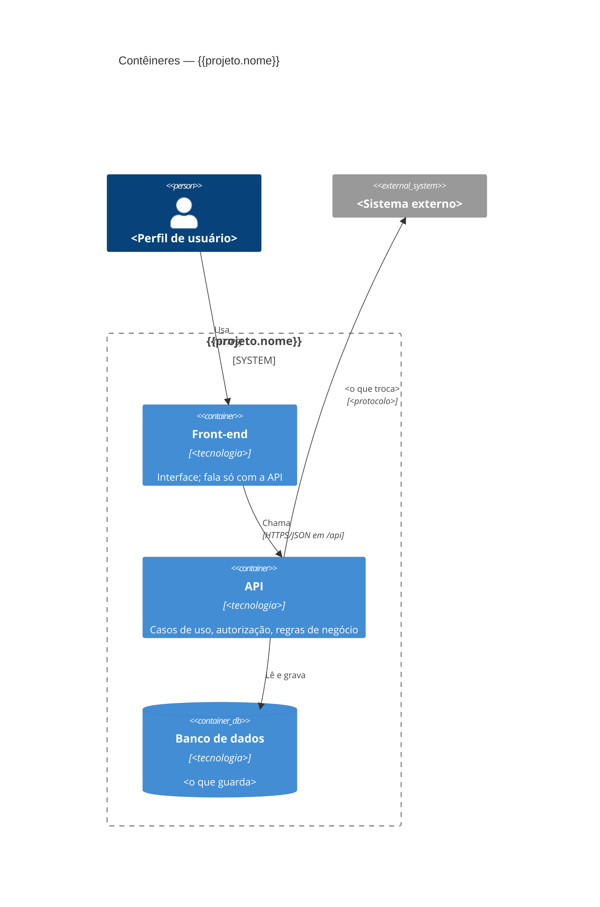

# {{projeto.nome}} — Contêineres (C4, nível 2)

<!-- Salve como docs/arquitetura/conteineres.md. Modelo C4: https://c4model.com
     O front fala só com o backend da própria aplicação (ARQ-06, SEG-IA-01). -->

| Contêiner | Tecnologia | Responsabilidade | Onde roda |
| --- | --- | --- | --- |
| Front-end | | | |
| API | | | |
| Banco de dados | | | |
