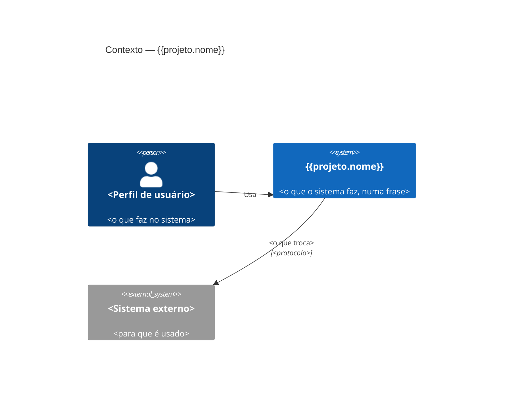

# {{projeto.nome}} — Contexto (C4, nível 1)

<!-- Salve como docs/arquitetura/contexto.md. Modelo C4: https://c4model.com -->

| Elemento | Responsabilidade |
| --- | --- |
| <Perfil de usuário> | |
| <Sistema externo> | |
