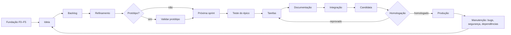

# 01 · Visão do processo

Os caminhos de documentação do sistema citados aqui são identificadores lógicos: leia com `bb documentacao ler <caminho>`. Em públicos, escreva e revise a proposta na Wiki; em privados, mantenha os arquivos locais. Aplique `.bigbang/processo/18-documentacao.md`, incluindo inventário, matriz, links e publicação confirmada também no Flash. README público é uma apresentação breve com Wiki, Discussions e painéis; conteúdo completo e screenshots ficam na Wiki.

Este é o mapa do processo do Big Bang: quem faz o quê, as palavras que usamos e onde cada coisa vive. Os outros
documentos desta pasta detalham cada etapa.

## Papéis

| Papel | Faz | Não faz |
| --- | --- | --- |
| **Dono** | Decide o produto, a stack, o design, o que entra no backlog, a homologação e a publicação em produção; aprova o que for sensível | Não precisa mover cartões nem rodar scripts: decide por label ou pela conversa |
| **IAs** | Executam: refinam com perguntas, escrevem testes, programam, revisam, documentam, rodam os botões e registram tudo | Nunca tomam decisão do dono; nunca aprovam o ambiente `producao` |
| **Automação** (GitHub Actions) | Move cartões, cria branches e issues, mescla PRs aprovados e verdes, calcula versão, publica | Nunca mescla na `main` fora de uma release; nunca publica sem o "ok" do dono |

Uma pessoa sozinha pode ser o dono e operar várias IAs ao mesmo tempo (veja [13-varias-ias.md](13-varias-ias.md)).

## Vocabulário

| Termo | Significado |
| --- | --- |
| **Épico** | Uma mudança com valor para quem usa, refinada até a *Definition of Ready*. É a unidade de planejamento, de homologação e de release |
| **Tarefa** | Um pedaço do épico que cabe num PR pequeno. Uma tarefa = uma branch = um PR |
| **Teste do épico** | Issue `teste-aceite` com todos os testes de aceite do épico, escrita **antes** das tarefas |
| **Documentação do épico** | Issue `documentacao`, a última do épico, com o checklist de documentação |
| **Bug** | Defeito em produção. É uma unidade de release, como um épico pequeno |
| **Sprint** | Período de trabalho de duração livre: começa quando o dono inicia e termina quando ele encerra. Não é versão |
| **Versão** | Número SemVer `X.Y.Z` de uma release, calculado a partir dos títulos dos PRs |
| **Candidata** | Versão `rc.N` (perfil compilado) ou implantação no staging (perfil deploy), pronta para homologar |
| **Homologação** | Teste do dono no épico inteiro (ou no bug), sobre a candidata |
| **Artefato** | O que o usuário recebe: o binário (compilado) ou a imagem implantada (deploy) |
| **Caminhos do artefato** | Pastas e arquivos que, se mudarem, exigem release (`entrega.caminhos_artefato` no `bigbang.toml`) |
| **Zona sensível** | Caminho que exige revisão humana (autenticação, pagamentos, migrações, `.github/`, decisões da raiz) |
| **Decisão do dono** | Label que só o dono põe, ou que a IA põe via `bb decisao` citando a frase dele |

## Ciclo de vida completo

1. **Fundação** ([02](02-fundacao.md)): perguntas, stack, design, GitHub, esteira e esqueleto andante.
2. **Planejamento** ([03](03-planejamento.md)): ideia → backlog → refinamento → protótipo → próxima sprint.
3. **Sprint** ([05](05-sprint.md)) e **execução** ([06](06-execucao.md)): teste do épico, tarefas, documentação.
4. **Entrega** ([09](09-entrega.md)): integração, candidata, homologação e produção, por épico.
5. **Manutenção** ([10](10-bugs-e-hotfix.md), [11](11-seguranca-operacional.md), [12](12-tecnologia-nova.md),
   [15](15-atualizacao-do-framework.md)): bugs, segurança, tecnologia nova e atualização do framework.

## Onde vive cada coisa

| O quê | Onde |
| --- | --- |
| O que o sistema é, a stack, o design | `PRODUTO.md`, `STACK.md`, `DESIGN.md` na raiz |
| Configuração de tudo que as ferramentas precisam | `bigbang.toml` |
| Instruções para as IAs | `AGENTS.md` (bloco gerado + seção "Projeto") |
| Procedimentos que se repetem | Skills em `.agents/skills/bb-*` (e cópia em `.claude/skills/`) |
| Regras e padrões | `.bigbang/padroes/` |
| Este processo | `.bigbang/processo/` |
| Regras de negócio, decisões, arquitetura, API, operação | `docs/` do sistema |
| Planejamento e andamento | Painéis *Planejamento*, *Execução* e *Bugs* (GitHub Projects) |
| Decisões do dono | Labels nas issues e PRs, com o comentário que as justifica |
| Código | Git, nas branches da [07](07-branches-e-commits.md) |
| Artefatos publicados | GitHub Releases (compilado) ou registro de imagens com digest (deploy) |
| Travas | CI (vale para qualquer IA e para humanos) e hooks (ajudam o Claude Code) |

## O que a automação faz sozinha

Move os cartões a partir de eventos do GitHub, cria branches, issues de teste/tarefa/documentação, mescla PRs
aprovados e verdes nas branches de épico, calcula versão e changelog, publica candidatas e, com o "ok" do dono no
ambiente `producao`, publica a versão homologada.
