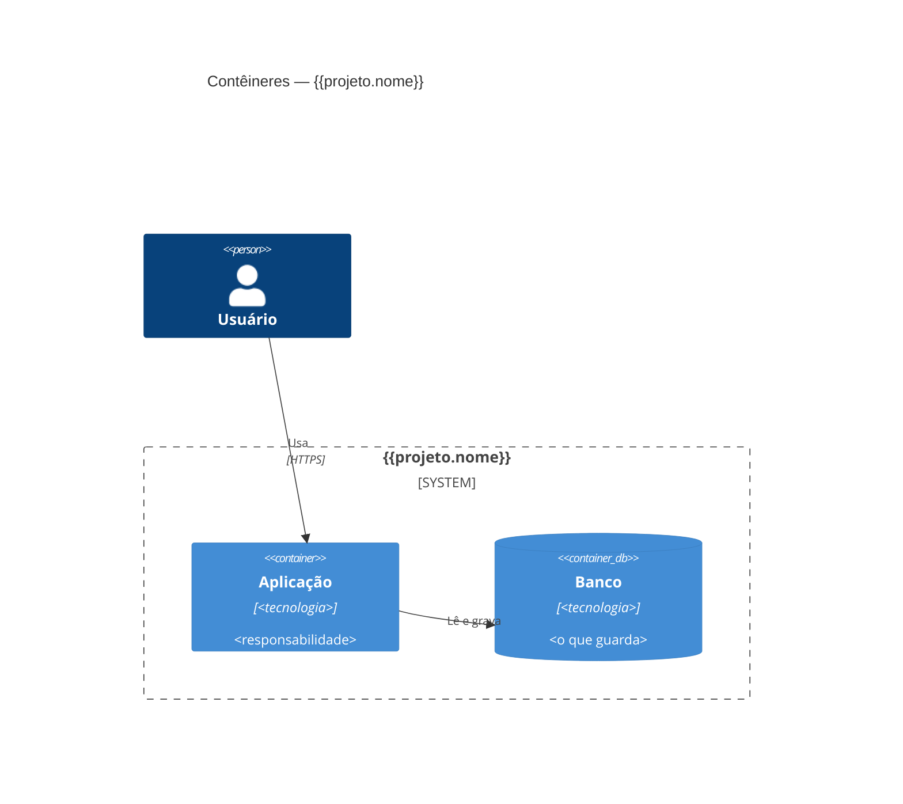

# {{projeto.nome}} — Stack

> Escrito na Fundação (F2). Só muda com decisão do dono registrada em ADR. Este arquivo é zona sensível: todo PR
> que o altera tem revisão humana.

## Resumo da decisão

<!-- Duas ou três frases. Decisão completa e alternativas descartadas: docs/decisoes/ADR-0001-stack.md -->

Decisão registrada em [ADR-0001](docs/decisoes/ADR-0001-stack.md).

## Linguagens, frameworks e versões

| Item | Escolha | Versão |
| --- | --- | --- |
| Linguagem | | |
| Framework | | |
| Front-end | | |
| Gerenciador de pacotes | | |

## Banco de dados

<!-- Banco, versão, ferramenta de migração. -->

## Tipo de entrega e alvo

<!-- Perfil (deploy | compilado) e alvo (vps-docker | aws | paas) ou sistemas (windows-x64, linux-x64, android…). -->

## Arquitetura

| Camada | Pasta | Pode depender de |
| --- | --- | --- |
| Domínio | | nada |
| Aplicação | | domínio |
| Infraestrutura | | aplicação, domínio |
| Interface (API/UI) | | aplicação |

## Ferramentas de qualidade

| Para quê | Ferramenta | Comando (`[comandos]` no `bigbang.toml`) |
| --- | --- | --- |
| Testes | | |
| Testes de aceite | | |
| Lint e formatação | | |
| Tipos | | |
| Arquitetura | | |
| Cobertura | | |

## Cobertura mínima

{{testes.cobertura_minima}}% nas camadas de domínio e aplicação.

## Configuração da esteira

<!-- bb:config:inicio -->
<!-- Gerado pelo Big Bang v1.5.5 a partir de bigbang.toml. Não edite: personalize em bigbang.toml. -->

**Perfil de entrega:** `deploy` · **Alvo:** `vps-docker`

**Caminhos do artefato** (mudança aqui exige release):

- `src/`
- `migrations/`
- `Dockerfile`
- `package.json`
- `package-lock.json`

**Zonas sensíveis** (revisão humana):

- `src/**/auth/**`
- `src/**/payments/**`
- `migrations/**`
- Sempre: `.github/**`, `tests/aceite/**`, `STACK.md`, `DESIGN.md`, `PRODUTO.md`, `bigbang.toml`, `flags.toml` e os arquivos de dependência da stack.

<!-- bb:config:fim -->

## Dependências de execução permitidas

Toda dependência **direta de execução** precisa estar nesta tabela (a *Guarda da stack* lê esta tabela).
Dependências de desenvolvimento são livres. Linha nova só com ADR e pelo portão de tecnologia (`bb-nova-tecnologia`).

<!-- bb:dependencias:inicio -->
| Pacote | Ecossistema | Faixa de versão | Para quê | ADR |
| --- | --- | --- | --- | --- |
<!-- bb:dependencias:fim -->

## Histórico de mudanças

| Data | O que mudou | ADR |
| --- | --- | --- |
| | Versão inicial (Fundação F2) | ADR-0001 |
