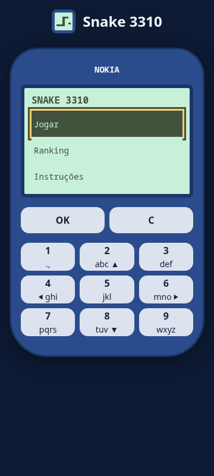

# Snake 3310

<!-- README do sistema (DOC-15). Escrito pela IA e mantido em dia a CADA épico e release: depois da primeira release
     publicada, a CI reprova este arquivo se faltar uma das seções obrigatórias, se ainda disser que está na Fundação
     ou se sobrar algum "(a preencher)". Troque cada "(a preencher)" pelo conteúdo real e apague estes comentários. -->

Sistema em construção com o [Big Bang](.bigbang/README.md), um framework para uma pessoa e suas IAs planejarem,
construírem e manterem sistemas profissionais.

A esteira usa a distribuição oficial Big Bang v1.5.1, com modo Flash e alvo Tsuru.

<!-- Logo da primeira release: uma imagem real do sistema (print da tela principal, em docs/imagens/), com texto
     alternativo que descreve o que ela mostra. -->

## Índice

- [Estado atual](#estado-atual)
- [Para que serve](#para-que-serve)
- [Recursos](#recursos)
- [Instalação](#instalação)
- [Como usar](#como-usar)
- [Para desenvolvedores](#para-desenvolvedores)
- [Versões e releases](#versões-e-releases)
- [Segurança e privacidade](#segurança-e-privacidade)
- [Limitações conhecidas](#limitações-conhecidas)
- [Contribuindo](#contribuindo)
- [Licença](#licença)

## Estado atual

O épico [#13](https://github.com/BrunodosSantosVaz/snake-3310/issues/13) está em implementação. O código já tem
servidor sob `BASE_PATH`, saúde, prontidão, migrações e listagem do ranking. A imagem leve ARM64 usa SQLite no
volume e migra antes de abrir HTTP. A tela do aparelho já permite navegar no menu e consultar os cinco maiores
placares. O épico #28 acrescenta a partida jogável com motor, controles, pausa e reinício (#31). Ainda não há release
publicada. A API já valida e grava os envios, filtra apelidos e limita tentativas por IP (#32); envio pelo modal (#33)
e entrega do ambiente continuam pendentes.
Os oito critérios da partida completa (#28) têm testes de aceite escritos antes da implementação (#30).

<!-- Depois da primeira release: a versão em produção, o que ela já faz e o que vem a seguir, em duas ou três frases. -->

## Para que serve

(a preencher) — o problema que o sistema resolve, para quem, em linguagem de quem usa (de `PRODUTO.md`).

## Recursos

- API pública de leitura `GET <BASE_PATH>/api/placares`: no máximo dez placares, por pontos decrescentes e, em
  empate, pelo envio mais antigo (RN-0001). Sem placares, retorna `{ "scores": [] }`.
- API pública de envio `POST <BASE_PATH>/api/placares`: apelido de 3 a 12 letras Unicode/números e pontos inteiros
  de 0 a 1.890, múltiplos de sete. Filtra vocabulário ofensivo sem distinguir caixa/acentos, grava UTC no servidor
  e responde 201. Tipos ou campos inválidos recebem 400 sem gravação; corpo limitado a 1 KiB.
- No máximo cinco tentativas de envio em 60 segundos por IP, inclusive inválidas. O sexto recebe 429 com
  `Retry-After` de 1 a 60 segundos. Os contadores expiram, ocupam no máximo 4.096 entradas e reiniciam com o processo.
- Servidor Fastify com `/api/health`, `/api/ready` e migrações SQLite, sempre sob `BASE_PATH`.
- Aparelho 3310 responsivo com menu, instruções e ranking conectado à API, operado por teclado ou pelas teclas
  clicáveis. Trata carregando, vazio, erro e nova tentativa.
- Partida em pixels na grade 21×13: três segmentos iniciais, passo de 180 ms, crescimento e sete pontos por comida,
  colisões, pausa manual ou ao perder foco e diálogo de fim com reinício. Inversões de 180 graus são ignoradas,
  inclusive quando há vários comandos antes do próximo passo. A grade cheia termina com 1.890 pontos.

## Instalação

(a preencher) — como conseguir e instalar a versão de produção (download, endereço, requisitos por plataforma).

## Como usar

Para consultar o ranking local depois de configurar o banco, aplicar as migrações e iniciar o servidor, faça
`GET <BASE_PATH>/api/placares`. A resposta contém só `nickname` e `points`; datas e IDs ficam no servidor.
A rota não aceita parâmetros de consulta: campos desconhecidos recebem 400. O contrato está em
[docs/api/openapi.yaml](docs/api/openapi.yaml). Na tela, use 2/8, setas ou W/S para selecionar, OK/Enter para abrir e
C/Esc para voltar. No ranking, OK repete a consulta. Em Jogar, use setas, WASD ou 2/4/6/8 para mover e espaço/5
para pausar e retomar. Perder o foco pausa; C/Esc volta ao menu. Após a partida, Jogar de novo começa com zero
pontos e devolve o foco à arena. O envio de placar ainda está pendente da tarefa #33; veja o
[guia da interface](docs/guias/interface.md).

Para usar a API de envio diretamente, envie JSON com somente `nickname` e `points`, por exemplo
`{"nickname":"ANA","points":70}`. O sucesso retorna os mesmos campos públicos. 400 indica entrada recusada;
429 pede aguardar o `Retry-After`; 413 indica corpo grande demais. O servidor define a data de envio e não aceita
data ou privilégios enviados pelo cliente. A chamada bem-sucedida aparece na próxima leitura do ranking.

## Para desenvolvedores

- Instruções para IAs: `AGENTS.md`. O que o sistema é: `PRODUTO.md`. A stack: `STACK.md`. O design: `DESIGN.md`.
- O processo de trabalho: `.bigbang/processo/`. Pegadinhas: `docs/memoria.md`.
- Requisitos: Node.js 24.18.1 e npm, conforme a stack e o runtime da imagem.
- CI: `bash scripts/install-ci.sh` verifica o download oficial de Node 24.18.1 por SHA-256 antes de `npm ci`;
  localmente exige essa versão. No modo Flash, `npm run test:affected` lê o arquivo JSON apontado por
  `BB_ARQUIVOS_ALTERADOS`, seleciona unidade/integração/aceite por dependência e conserva cobertura de 80%
  nos módulos afetados de domínio/aplicação. Configuração estrutural, produção ou grafo incerto recebem a suíte
  completa. Veja [CI e testes afetados](docs/operacao/ci.md) e [ADR-0004](docs/decisoes/ADR-0004-flash-tsuru-ci.md).
- Comandos: `npm ci` (instala), `npm run lint`, `npm run typecheck`, `npm test` (unidade),
  `npm run test:acceptance` (aceite), `npm run test:architecture` (camadas), `npm run test:coverage`,
  `npm run test:migracoes` e `npm run build`. Depois do build: `npm start` aplica migrações antes de abrir HTTP; `npm run migrar` é a CLI opcional para o mesmo arquivo.
- `npm run dev` abre o Vite para a interface e encaminha `/api` para o servidor local na porta 8080;
  `npm run build` compila servidor e front em `dist/server` e `dist/web`, com caminhos relativos no front.
- `npm run test:ui` serve o build real sob a CSP do Fastify e valida teclado, cinco linhas, contraste/acessibilidade
  com axe, layout em 360 px e texto ampliado em 200% no Chromium.
  Instale o navegador de teste com `npx playwright install chromium` antes de executar esse comando.
  `npm run test:acceptance` prepara o build antes do Vitest e, na CI, instala Chromium/dependências;
  falta de navegador ou erro de build falha fora das marcas de pendente. Os testes DOM
  e de semântica com axe também rodam em `npm test` na CI.
- Depois do build, `node scripts/check-game-ui.mjs` verifica o movimento real do canvas, pausa, reinício,
  foco, área de toque, layout de 360 px/texto200% e axe em Chromium com a CSP do servidor. A cobertura inclui
  o motor puro do navegador, além das camadas de domínio e aplicação.
- Os testes usam SQLite nativo real, isolado em memória e em arquivo temporário (ADR-0003); não é preciso instalar banco nem fornecer credenciais.
- Variáveis de ambiente do servidor (os valores ficam só no servidor): `BASE_PATH` (endereço do jogo, por exemplo
  `/snake-3310`), `SQLITE_PATH` (arquivo persistente, padrão `data/snake-3310.sqlite`, fora de `dist`), `PORT` (padrão 8080), `WEB_DIR` (padrão `dist/web`) e `MIGRATIONS_DIR` (startup e CLI; padrão
  `migrations`).
- `TRUSTED_PROXY_IPS` é uma lista separada por vírgulas de IPs individuais do último salto; vazia por padrão.
  Só essas conexões podem informar um único IP válido em `X-Snake-Client-IP`, sobrescrito/saneado pelo proxy.
  IPv4 e IPv6 mapeado são equivalentes. `X-Forwarded-For`, faixas de rede e cabeçalhos de peers não confiados
  não mudam a identidade do limite. Cabeçalho ausente ou inválido usa o próprio peer.
- Para rodar localmente: `npm ci`, `npm run build`, `npm start`. O ranking persiste no arquivo mesmo após reiniciar o processo; o diretório `data/` é ignorado pelo Git.
- Produção precisa de volume persistente por ambiente e uma réplica; arquivo efêmero perde placares. A imagem inicia como usuário `node` (UID/GID 1000), com `umask 077`, e aplica migrações na mesma conexão antes de listen. Falha impede abrir HTTP. Nunca copie só o arquivo principal para backup enquanto WAL estiver ativo. Veja [ADR-0003](docs/decisoes/ADR-0003-sqlite-embutido.md).
- Migrações executam o lote SQL completo em transação, inclusive se começar com SELECT; consultas preparadas aceitam uma única instrução. Caminhos como `dist/..cache/scores.sqlite` também são recusados.
- A imagem expõe a porta 8888, guarda SQLite em `/data/scores.sqlite` e inclui os tokens do design no build. O helper `deploy/compose.yaml` compartilha volume e não instala banco externo. Veja [empacotamento](docs/operacao/empacotamento.md) para build, permissões do volume e inicialização no Tsuru.
- `npm run test:smoke` usa fetch nativo contra `BB_URL` ou `SMOKE_URL`, sem instalar dependências de teste; verifica saúde, prontidão, página, CSP e ranking.
- `NODE_ENV=production` ativa HSTS por um ano. CSP restrita ao próprio site, proteção contra frames, nosniff,
  política de referrer e bloqueio de câmera/microfone/localização são enviados em todas as respostas.

(a preencher) — estrutura do repositório, como rodar a partir do código, testes e build (comandos de
`bigbang.toml` `[comandos]`), variáveis de ambiente sem valores.

## Versões e releases

(a preencher) — onde ficam as versões (Releases), o que é homologação e produção, onde está o `CHANGELOG.md`.

## Segurança e privacidade

(a preencher) — que dados o sistema trata, o que nunca sai do aparelho/servidor, como relatar uma falha de segurança.

## Limitações conhecidas

Não há autenticação nem prova criptográfica da partida: um cliente pode forjar pontos que respeitem os limites
plausíveis de 0 a 1.890 e múltiplos de sete. O filtro local usa uma lista de termos e pode recusar apelidos que
contenham um trecho bloqueado ou deixar passar outras ofensas. O limite é por processo, com uma réplica; reiniciar
zera os contadores. Se todas as 4.096 entradas estiverem ativas, novos IPs recebem 429 até uma delas expirar.
Jogadores que compartilham um IP também compartilham o limite. O envio pelo modal ainda está na tarefa #33.

## Contribuindo

Pedidos e bugs pelas issues, nos formulários do repositório. O trabalho segue a esteira do Big Bang
(`.bigbang/processo/`): toda mudança chega por PR revisado.

## Licença

(a preencher) — a licença do sistema (arquivo `LICENSE`) e avisos de componentes de terceiros.
