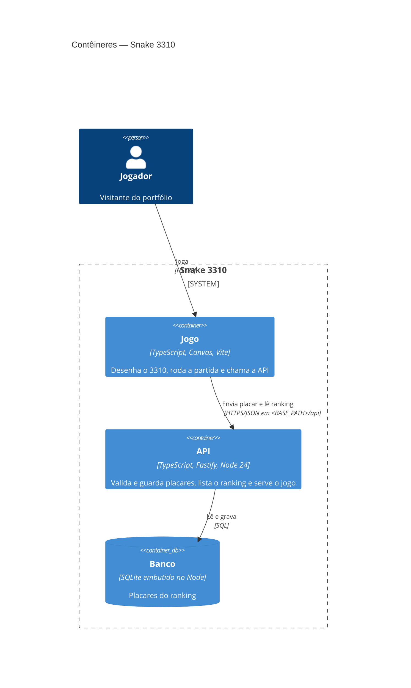

# Snake 3310 — Stack

> Escrito na Fundação (F2). Só muda com decisão do dono registrada em ADR. Este arquivo é zona sensível: todo PR
> que o altera tem revisão humana.

## Resumo da decisão

TypeScript ponta a ponta. O front é um jogo em Canvas feito com Vite. A API usa Fastify em Node 24 e guarda o
ranking em SQLite embutido (`node:sqlite`), sem servidor de banco. Uma imagem `linux/arm64` serve as duas partes sob um prefixo de caminho configurável
(`/snake-3310`). A entrega usa o Tsuru existente no `vm-oracle`, promovendo o digest da imagem OCI.

Decisões registradas em [ADR-0001](docs/decisoes/ADR-0001-stack.md) e [ADR-0003](docs/decisoes/ADR-0003-sqlite-embutido.md), que substitui a escolha do banco.
O [ADR-0004](docs/decisoes/ADR-0004-flash-tsuru-ci.md) define Flash, alvo Tsuru e runtime verificável da CI.

## Linguagens, frameworks e versões

| Item | Escolha | Versão |
| --- | --- | --- |
| Linguagem | TypeScript | `~6.0.3`, fixa: o typescript-eslint 8.71 aceita só `<6.1.0` |
| Runtime | Node.js LTS | 24.18.1 (imagem fixada por digest na tarefa #19; CI verificada por SHA-256) |
| Framework (API) | Fastify | 5.x |
| Front-end | Canvas 2D com Vite, sem framework de UI | Vite 8.x |
| Gerenciador de pacotes | npm (com `package-lock.json`) | o do Node 24 |

## Banco de dados

SQLite do próprio Node 24.18.1, via `node:sqlite`, sem pacote npm de execução. A API está em **Release Candidate
(Stability 1.2)**. `SQLITE_PATH` configura o arquivo durável fora de `dist`, com padrão local
`data/snake-3310.sqlite`. Só a API acessa o banco (SEG-IA-01); o front continua chamando apenas a API.

WAL, `synchronous=FULL`, timeout de 5000 ms e transações `BEGIN IMMEDIATE` coordenam gravações e migrações.
As migrações SQL numeradas continuam em `migrations/`, com CLI `npm run migrar` e registro idempotente.
A tarefa #19 implementa migração na mesma conexão/arquivo antes de listen. Produção requer uma réplica, PVC por ambiente,
backup consistente e restauração. As exceções ARQ-07/DAD-03 estão no ADR-0003 e em
[docs/padroes/excecoes.md](docs/padroes/excecoes.md); não se aceita disco efêmero como persistência.

## Tipo de entrega e alvo

- **Perfil:** `deploy`.
- **Alvo:** `tsuru` no `vm-oracle` (ARM64), com imagem `linux/arm64` no GHCR, publicada pelo digest.
- **URLs:** produção em `https://tsuru.frontzap.com.br/snake-3310` e staging em
  `https://tsuru.frontzap.com.br/snake-3310-hom`. O NPM manda cada caminho para o contêiner do ambiente
  (*custom location*).
- **Prefixo de caminho:** a variável `BASE_PATH` é lida na execução, e o Vite usa `base: './'`. A mesma imagem
  roda em qualquer caminho (ARQ-07).
- **Saúde da entrega:** `/api/ready`, que verifica o banco. Configure `TSURU_MIGRACAO=inicializacao` por ambiente,
  conforme o ADR-0003 e [o guia do alvo](.bigbang/docs/deploy-tsuru.md).

## Arquitetura

| Camada | Pasta | Pode depender de |
| --- | --- | --- |
| Domínio | `src/dominio/` | nada |
| Aplicação | `src/aplicacao/` | domínio |
| Infraestrutura | `src/infra/` | aplicação, domínio |
| Interface (API/UI) | `src/interface/` (API Fastify e *composition root*) e `src/web/` (jogo) | aplicação. O `src/web/` não importa nada do servidor e fala só pela API |

## Ferramentas de qualidade

| Para quê | Ferramenta | Comando (`[comandos]` no `bigbang.toml`) |
| --- | --- | --- |
| Testes | Vitest 5 | `npm test` |
| Testes afetados (Flash) | Grafo Vitest/Vite, aceite mapeado e cobertura de módulos afetados | `npm run test:affected` |
| Testes de aceite | Vitest 5, com a API via `fastify.inject` e SQLite real em memória e arquivo temporário ([ADR-0003](docs/decisoes/ADR-0003-sqlite-embutido.md)) | `npm run test:acceptance` |
| Fumaça (smoke) | Node/fetch nativo, contra a URL do ambiente | `npm run test:smoke` |
| Lint e formatação | ESLint 10 com typescript-eslint 8 | `npm run lint` |
| Tipos | `tsc --noEmit` | `npm run typecheck` |
| Arquitetura | dependency-cruiser 18 | `npm run test:architecture` |
| Cobertura | @vitest/coverage-v8 | `npm run test:coverage` |

## Cobertura mínima

80% nas camadas de domínio e aplicação. No Flash, os mesmos quatro limites se aplicam aos módulos afetados
e suas dependências dessas camadas; estrutura, produção, major/minor e seleção incerta exigem suíte completa.

## IP do jogador atrás do proxy

`TRUSTED_PROXY_IPS` configura até 64 IPs individuais do último salto, separados por vírgulas; por padrão não
há proxy confiado. A inicialização recusa valores que não sejam IPs (incluindo hostnames, portas e CIDR).
O backend mantém `trustProxy: false`. Apenas o socket de um peer explicitamente configurado pode apresentar
o único IP válido de `X-Snake-Client-IP`, saneado e sobrescrito no NPM. Valores inválidos ou múltiplos usam o
peer; `X-Forwarded-For` nunca é consultado. IPv4 mapeado em IPv6 é normalizado antes de conferir confiança
e contar tentativas. O limite usa no máximo 4.096 contadores locais e expira em 60 segundos; reinício os zera.

## Configuração da esteira

<!-- bb:config:inicio -->
<!-- Gerado pelo Big Bang v1.5.5 a partir de bigbang.toml. Não edite: personalize em bigbang.toml. -->

**Perfil de entrega:** `deploy` · **Alvo:** `tsuru`

**Caminhos do artefato** (mudança aqui exige release):

- `src/`
- `migrations/`
- `Dockerfile`
- `.dockerignore`
- `deploy/`
- `scripts/`
- `docs/design/`
- `package.json`
- `package-lock.json`
- `vite.config.ts`
- `tsconfig.json`

**Zonas sensíveis** (revisão humana):

- `migrations/**`
- `src/interface/http/seguranca/**`
- `src/dominio/apelido/**`
- Sempre: `.github/**`, `tests/aceite/**`, `STACK.md`, `DESIGN.md`, `PRODUTO.md`, `bigbang.toml`, `flags.toml` e os arquivos de dependência da stack.

<!-- bb:config:fim -->

## Dependências de execução permitidas

Toda dependência **direta de execução** precisa estar nesta tabela (a *Guarda da stack* lê esta tabela).
Dependências de desenvolvimento são livres. Linha nova só com ADR e pelo portão de tecnologia (`bb-nova-tecnologia`).

<!-- bb:dependencias:inicio -->
| Pacote | Ecossistema | Faixa de versão | Para quê | ADR |
| --- | --- | --- | --- | --- |
| `fastify` | npm | `^5.12.0` | Servidor HTTP da API e do jogo | ADR-0001 |
| `@fastify/rate-limit` | npm | `^11.2.0` | Limite de envios de placar (SEG-IA-05) | ADR-0001 |
| `@fastify/static` | npm | `^10.1.0` | Servir o jogo compilado sob `BASE_PATH` | ADR-0001 |
<!-- bb:dependencias:fim -->

## Histórico de mudanças

| Data | O que mudou | ADR |
| --- | --- | --- |
| 06/10/2026 | Versão inicial (Fundação F2) | ADR-0001 |
| 06/10/2026 | Testes de aceite e de integração com PGlite no lugar de contêiner (proposta) | ADR-0002 |
| 06/10/2026 | SQLite nativo Node 24.18.1 substitui pg e PGlite; arquivo persistente e testes no mesmo motor | ADR-0003 |
| 07/10/2026 | Flash, Tsuru e CI fixada em Node 24.18.1 | ADR-0004 |
