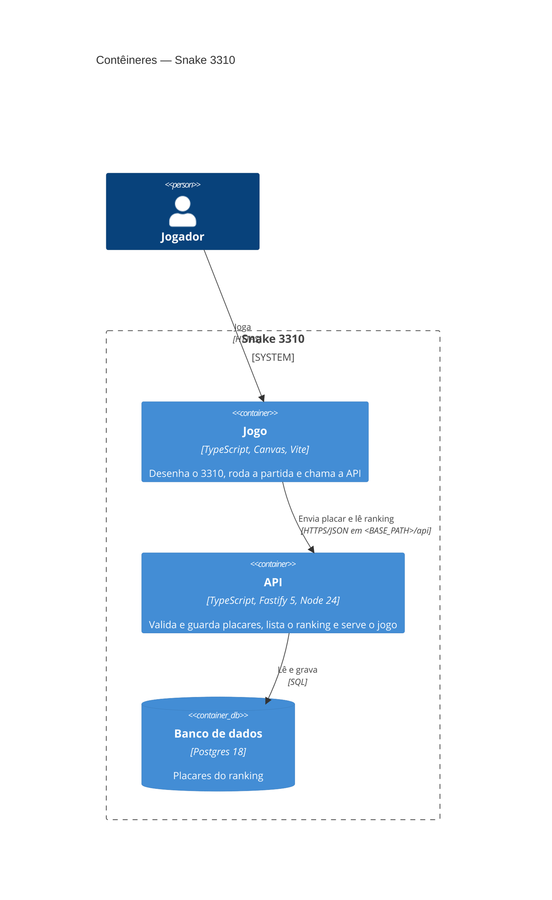

# Snake 3310 — Contêineres (C4, nível 2)

O jogo fala só com a API da própria aplicação (ARQ-06, SEG-IA-01).

| Contêiner | Tecnologia | Responsabilidade | Onde roda |
| --- | --- | --- | --- |
| Jogo | TypeScript, Canvas 2D, Vite 8 | Tela e teclado do 3310, laço da partida e envio do placar | Navegador; arquivos servidos pela API |
| API | TypeScript, Fastify 5, Node 24 | Validação do placar, filtro de apelido, limite de envios, ranking, saúde em `<BASE_PATH>/api/health` | Imagem `linux/arm64` no `vm-oracle`: Docker Compose (`vps-docker`) agora, Tsuru depois |
| Banco de dados | Postgres 18 | Placares (apelido, pontos, data) | Postgres do `vm-oracle`, com banco e usuário próprios por ambiente |
