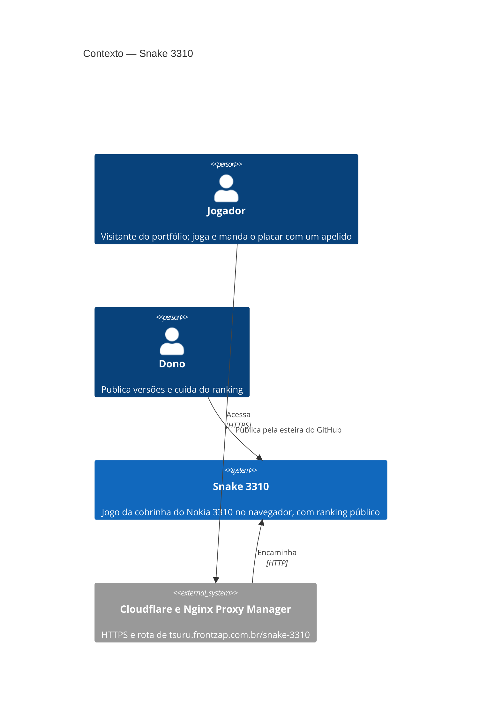

# Snake 3310 — Contexto (C4, nível 1)

| Elemento | Responsabilidade |
| --- | --- |
| Jogador | Joga no PC ou no celular e manda o placar ao ranking com um apelido |
| Dono | Aprova as publicações em produção e cuida do ranking |
| Cloudflare e Nginx Proxy Manager | Terminam o HTTPS e mandam cada caminho (`/snake-3310`, `/snake-3310-hom`) ao ambiente certo |
