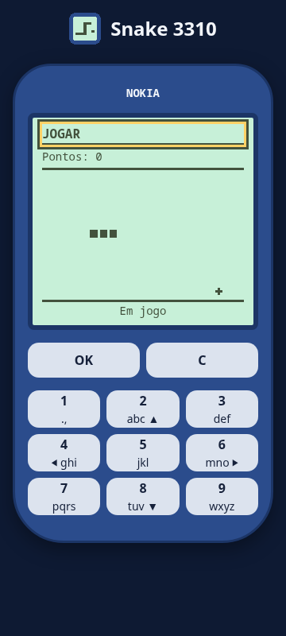

# Menu, partida e ranking

A tela reproduz um aparelho Nokia 3310 e permite jogar, consultar o ranking e abrir instruções.

No menu, use as teclas 2/8, as setas para cima/baixo ou W/S para escolher uma opção. OK, 5 ou Enter abrem a opção
selecionada. As opções também são botões acessíveis por Tab e clique. C ou Esc voltam ao menu e restauram o foco.

Em Jogar, a cobra começa com três segmentos e anda a cada 180 ms. Use setas, WASD (maiúsculas ou minúsculas)
ou 2/4/6/8, no teclado físico ou nas teclas clicáveis, para mudar a direção. A inversão de 180 graus é ignorada.
Comer acrescenta um segmento e sete pontos; a comida aparece sempre numa célula livre. Bater na parede ou no
corpo termina a partida. Completar a grade de 21×13 termina com 1.890 pontos.

Espaço ou 5 pausa e retoma; OK também retoma. Quando a janela perde o foco, o jogo pausa e espera que você
retome. C ou Esc encerra a partida atual e volta ao menu. O placar e o estado aparecem em texto acessível.
O diálogo de fim mostra os pontos e coloca o foco em Apelido. Use de 3 a 12 letras Unicode ou números, sem
espaços ou símbolos; o apelido será público. Escolha Enviar placar ou pressione Enter no campo. Enquanto
“Enviando…” aparece, o envio fica bloqueado. “Placar enviado!” confirma o resultado e impede novo envio nessa
partida. Voltar ao menu e abrir Ranking consulta os dados atualizados.

“Esse apelido não pode. Escolha outro.” permite corrigir o nome. “Muitos envios seguidos. Tente de novo em
1 minuto.” pede uma pausa; “Não deu para enviar. Tente de novo.” permite repetir após falha de rede/servidor.
Jogar de novo começa do zero e devolve o foco à tela do jogo. Voltar ao menu ou Esc encerra o diálogo. Reiniciar
ou sair cancela a espera e ignora respostas antigas, mas não desfaz uma gravação que o servidor já concluiu.
Se a conexão cair após gravar, uma repetição pode duplicar o placar; não há chave de idempotência na API.

A API de envio já recebe somente `nickname` e `points` em JSON: apelido público de 3 a 12 letras Unicode/números,
sem espaços/símbolos nem termo bloqueado, e pontos inteiros de 0 a 1.890, múltiplos de sete. Apelido ou pontos
recusados não gravam placar. Há cinco tentativas por minuto por IP, contando entradas inválidas; depois disso,
aguarde o tempo informado em `Retry-After` antes de repetir. Sucesso recebe 201 e entra no ranking.
O servidor determina a data; pontos plausíveis podem ser forjados, pois a partida não tem prova criptográfica.

O ranking busca os placares na API do próprio servidor, no prefixo configurado em `BASE_PATH`. Exibe os cinco
primeiros, por pontos decrescentes e desempate pelo envio mais antigo, enquanto a API disponibiliza os dez primeiros.
Apelidos aparecem como texto e pontos usam formato brasileiro, por exemplo `1.234`.

Durante a consulta aparece “Carregando…”. Sem placares, “Ninguém ainda. Seja o primeiro!”. Se a rede, a API ou o
formato da resposta falharem, “Sem conexão. OK tenta de novo”. Pressione OK para repetir a consulta ou C para voltar.

O teclado numérico é clicável em computadores e celulares. A interface foi verificada com 360 px de largura,
sem rolagem horizontal; as teclas têm área de toque mínima de 44 × 44 px e o foco é visível. A tela cresce quando
o texto é ampliado em 200%, mantendo apelidos e pontos completos com quebra de linha, sem reticências. O contorno
amarelo recebe uma borda escura sobre a tela verde para manter contraste perceptível.

