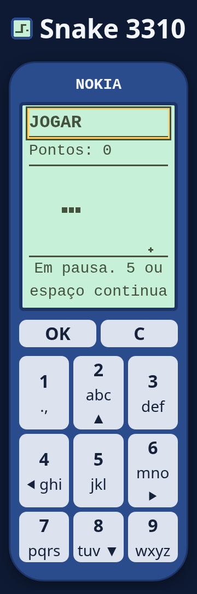

# Produção Snake 3310 v0.1.0 — 08/10/2026

## Artefato e portões

A [v0.1.0](https://github.com/BrunodosSantosVaz/snake-3310/releases/tag/v0.1.0) está publicada pelo
[run 37766740098](https://github.com/BrunodosSantosVaz/snake-3310/actions/runs/37766740098), todos os jobs SUCCESS.
O portão executou a suíte completa antes de produção na fonte da imagem
`7a770ff4be050598f8cebea9718d372145e1d3eb`: 135 unidade/integração, 13 CA e 128 na cobertura 100%.
A [candidata RC2](https://github.com/BrunodosSantosVaz/snake-3310/actions/runs/37596185419),
[CI exata](https://github.com/BrunodosSantosVaz/snake-3310/actions/runs/37596189652) e
[revisão independente](https://github.com/BrunodosSantosVaz/snake-3310/pull/60#issuecomment-6051531113)
precederam a promoção pelo PR60. A aprovação do ambiente foi delegada pela autorização explícita do dono;
política MAIN, revisão e portões foram preservados, sem aprovação física inventada.

O commit da tag/promoção é `3249621bbe58ccdbef5c6ad2618398b91131ecd9`; não é o SHA fonte que construiu a imagem.
`imagem.txt` aponta para `ghcr.io/brunodossantosvaz/snake-3310@sha256:12fb06c1c51f72772358d7cf6dfd2a7b4468af13c5f4917946d290477b2acac1`.
Esse digest e os dois SBOMs são iguais à candidata; não houve reconstrução na promoção.
SBOM principal/ARM64 CycloneDX 1.7: 101 componentes, SHA-256
`6c6e25ae78bf9806924f2c74d77419a3e343b2ff3dff5b2d0874458b7aba1e96`.
A atestação GitHub confere origem OCI/fonte; não há alegação de atestação separada do arquivo SBOM.
Trivy HIGH/CRITICAL zero; ZAP FAIL zero/WARN 9, com cabeçalhos da raiz Tsuru fora do prefixo e avisos cache/COEP.

## Ensaio remoto

[Homologação](https://tsuru.frontzap.com.br/snake-3310-hom/) e
[produção](https://tsuru.frontzap.com.br/snake-3310/) responderam200.
Chromium confirmou movimento real do canvas, pausa/reinício, foco no modal, um POST 201 por partida e
leitura do ranking, layout 360 px/texto 200%, toque 44 px, axe zero nos estados observados e nenhum erro JavaScript.
A captura de produção usa placar sintético, sem dados de jogadores.

Na produção, seis POSTs inválidos com cabeçalhosX-Forwarded-For/X-Real-IP/X-Snake-Client-IP variáveis receberam
cinco 400 e um 429/Retry-After 60, sem gravar placares: cabeçalhos falsos não contornaram a quota.
O último peer confiável e o saneamento NPM permanecem restritos conforme o runbook de infraestrutura.
Não é um ensaio de todos os dispositivos ou uma certificação integral de acessibilidade.

## SQLite e recuperação local

Tsuru importou a mesma origem como `app-snake-3310-hom:v3` e `app-snake-3310:v1`.
Esses nomes internos não substituem a identidade OCI acima. Ambas apps têm uma unidade Ready após rollout,
zero reinícios, PVC Bound/Retain de 2 GiB, diretório UID/GID 1000/0700 e SQLite 1000:1000/0600.
`SQLITE_PATH=/data/snake.sqlite`; uma migração e `quick_check=ok`.

Reinício pela API em cada ambiente criou novo pod e preservou o placar sintético no mesmo banco.
A limpeza parametrizada posterior removeu somente a linha de teste com ID/apelido/pontos zero exatos;
os três placares reais de homologação foram preservados. Nenhum dado real foi apagado.

Às 11:07:02 UTC de 08/10, o daemon cron enabled/active gerou snapshots cifrados de ambas apps.
O ensaio antecipou temporariamente somente esse job para o próximo minuto e restaurou seus bytes originais
`17 * * * *`, root/0644/PATH explícito; demais jobs preservados.
Checksum e decifração em tmpfs passaram e os bancos restaurados têm quick_check=ok/uma migração,
três registros hom e zero produção após limpeza QA. Diretório de backup 0700/arquivo 0600, sem SQLite em claro ou .tmp residual.

| App | Snapshot daemon | SHA-256 cifrado |
| --- | --- | --- |
| Homologação | `20261008T110702077613Z.sqlite.age` | `ccfa213640162f776b963fb5f3bd6d84daf873f0c2e8dd854d3dd92ff38945cb` |
| Produção | `20261008T110702077613Z.sqlite.age` | `2ae3e3f491731167633f9c569bc3b11c1584b2d03f90508bcb3ca30baa0c489f` |

O [runbook Oracle](https://github.com/BrunodosSantosVaz/oraclecloud/tree/main/infra/tsuru)
foi atualizado pelo [PR2](https://github.com/BrunodosSantosVaz/oraclecloud/pull/2), revisão independente e merge.
A cópia cifrada e a chave permanecem no mesmo host, retenção 14 dias; custódia externa e recuperação após perda
completa do servidor não foram exercitadas. Na primeira versão não há versão estável anterior para rollback;
a receita mantém o contrato de voltar à imagem anterior sem inventar uma execução inexistente.

## Documentação e rastreabilidade

[Plano #65](../validacao/65-producao-010.md) anterior à atualização #67 e conferência #68, com 13 CA/seis RN preservados.
O [mapa #34](documentacao-34.md) liga os critérios do jogo a RN/teste/tarefa/PR.
CA #55 é prova histórica da Fundação no SHA indicado no seu runbook; não é14º CA da aplicação.
O framework 1.5.3 foi instalado pelo [PR #64](https://github.com/BrunodosSantosVaz/snake-3310/pull/64):
instalador conferiu hash/atestação, revisão independente e CI completa no SHA exato, sem alterar jogo/configuração Flash/Tsuru.
Publicação documental segue sem release, sem nova imagem nem tag do jogo; o encerramento é registrado no épico #65.
